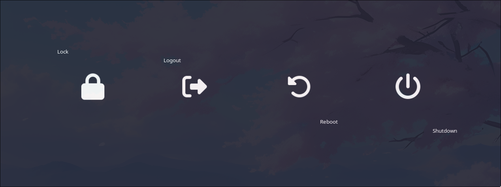

# rlogout
A rewrite of [wlogout](https://github.com/ArtsyMacaw/wlogout) in Rust and GTK4.

## Notable differences
- Layout file is named `layout.json` instead of `layout`
- Layout file must be a valid json file (put the original `layout` file in an array and separate
  each entry with a comma) (see [layout.json](layout.json))
- Config directory is `rlogout` instead of `wlogout` (example: `~/.config/rlogout`)

## Additional features
- optional `label_x_align`, and `label_y_align` to manipulate the position for the label of buttons
  (see [layout.json](layout.json))

- allow using "Enter"/"Space" on focused buttons (navigate buttons with arrow keys)

- `-d, --disable-mouse-input` option

- `-a, --auto-margin`, `-H, --button-height <BUTTON_HEIGHT>`, and `-W, --button-width <BUTTON_WIDTH>`
  options. 

- `-M, --mirror-window` option. Put buttons on all windows.

## Build
To install the dependencies, you would need to use [nix](https://nixos.org/download/). Once you have
that, run `nix-shell`. This will install and load all dependencies listed in [shell.nix](shell.nix).
